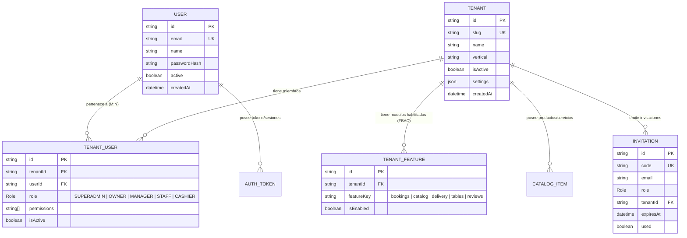

# ⚙️ Especificación Técnica: Gestión de Usuarios y Tenants (Backend)
### Aurea Backoffice Backend · `backoffice-be-aurea`

Este documento define la arquitectura técnica, modelo de datos, middlewares, guards de seguridad, matriz de autorización (RBAC + FBAC) y catálogo de endpoints para la **Gestión de Usuarios y Tenants** en el backend de Aurea.

---

## 1. Modelo de Datos y Entidades (Prisma / MongoDB)

El backend implementa un modelo de **Identidad Única Global con Membresías Multi-Tenant**. Un usuario existe una sola vez a nivel global y se vincula a uno o más comercios mediante la relación `TenantUser`.



---

## 2. Niveles de Gestión y Flujos Operativos

### A. Nivel SuperAdmin (Gestión Global de Plataforma)
Controlado por el módulo `SuperadminModule` (`/superadmin/*`). Requiere que el usuario autenticado posea el rol global `Role.SUPERADMIN`.

1. **Aprovisionamiento de un nuevo Tenant:**
   - Valida unicidad del `slug` (ej: `salon-glamour`, `pizzeria-roma`).
   - Crea el registro `Tenant`.
   - Inicializa el catálogo de Feature Flags (`TenantFeature`) según el plan contratado.
   - Crea o vincula al usuario `OWNER` mediante un registro inicial en `TenantUser`.
2. **Conmutación de Módulos FBAC (Feature-Based Access Control):**
   - Endpoints `POST /superadmin/tenants/:id/features` y `PUT /superadmin/tenants/:id/features`.
   - Permite activar o desactivar módulos individuales (`bookings`, `delivery`, etc.) para un comercio sin requerir cambios de código ni redeploys.
3. **Suspensión / Reactivación de Tenants:**
   - Si `Tenant.isActive == false`, todos los requests subsiguientes a ese comercio (incluso de su dueño) son rechazados por el `TenantContextGuard` con `403 Forbidden: Tenant is inactive`.

---

### B. Nivel Comercio (Gestión de Equipo / Tenant Admin)
Controlado por el módulo `TenantModule` (`/tenant/*`). Requiere que la petición incluya el header `x-tenant-id` y que el usuario tenga una membresía activa en ese tenant.

1. **Resolución de Contexto del Comercio (`GET /tenant/context`):**
   - Devuelve información del establecimiento, configuración (`settings`), lista de features activas (`TenantFeature`) y el rol/permisos del usuario actual dentro del local.
2. **Gestión de Colaboradores (`GET|POST /tenant/members`):**
   - **Listar equipo:** Retorna todos los `TenantUser` asociados al comercio con los datos básicos del `User`.
   - **Invitar / Añadir miembro:**
     - El `OWNER` o `MANAGER` ingresa el email y rol deseado (`MANAGER`, `STAFF`, `CASHIER`).
     - Si el usuario ya existe en Aurea, se crea la vinculación `TenantUser` inmediatamente.
     - Si el usuario es nuevo, se genera una `Invitation` con un token seguro y fecha de expiración, enviando un correo con el link de acceso.

---

## 3. Matriz Tridimensional de Autorización

Para que cualquier petición sea procesada en el backend, debe superar una verificación de 3 capas en orden secuencial:

```text
[Request HTTP]
      │
      ▼
1. JwtAuthGuard ────────────► ¿Token JWT válido? (Identifica al User)
      │
      ▼
2. TenantContextGuard ──────► ¿Header 'x-tenant-id' presente?
                              ¿Tenant existe y está activo (isActive = true)?
                              ¿User tiene membresía activa en TenantUser?
      │
      ▼
3. RolesGuard (RBAC) ───────► ¿El rol del usuario (OWNER/MANAGER/etc.) cubre @Roles()?
      │
      ▼
4. FeatureGuard (FBAC) ─────► ¿El módulo (@RequireFeature('bookings')) está activo en TenantFeature?
      │
      ▼
[Handler del Controlador]
```

### Roles y Jerarquía RBAC:
- **`SUPERADMIN`**: Administrador de plataforma Aurea. Acceso total e irrestricto a `/superadmin/*`.
- **`OWNER`**: Propietario del comercio. Acceso total a la configuración del local, facturación, catálogo, turnos, pedidos y gestión de miembros.
- **`MANAGER`**: Encargado del local. Gestión operativa completa (catálogo, turnos, pedidos, horarios e invitación de personal operativo). No puede transferir la propiedad del comercio ni eliminar al Owner.
- **`STAFF`**: Personal operativo (ej. peluquero, masajista, mozo). Visualización y gestión de sus propios turnos asignados o comandas.
- **`CASHIER`**: Cajero / Mostrador. Gestión de cobros, recepción de pedidos y visualización de comandas.

---

## 4. Catálogo de Endpoints de la API

### 🛡️ Endpoints de SuperAdmin (`/superadmin/*`)
*Requiere `Role.SUPERADMIN`.*

| Método | Endpoint | Descripción | Body / Params |
| :--- | :--- | :--- | :--- |
| `GET` | `/superadmin/tenants` | Lista todos los comercios registrados con métricas y estado. | Query: `page`, `limit`, `search`, `vertical` |
| `GET` | `/superadmin/tenants/:id` | Detalle completo de un tenant, sus features y miembros. | Param: `id` (ObjectId) |
| `POST` | `/superadmin/tenants` | Crea un nuevo tenant con su owner y features iniciales. | `CreateTenantDto` (`name`, `slug`, `vertical`, `ownerEmail`, `features`) |
| `PATCH`| `/superadmin/tenants/:id` | Actualiza datos del comercio o conmuta `isActive`. | `UpdateTenantDto` (`name`, `isActive`, `vertical`, `settings`) |
| `POST` | `/superadmin/tenants/:id/features` | Asigna o actualiza una feature flag específica. | `AssignFeatureDto` (`featureKey`, `isEnabled`) |
| `PUT`  | `/superadmin/tenants/:id/features` | Actualiza por lote todas las feature flags del tenant. | `BatchFeaturesDto` (`features: { featureKey, isEnabled }[]`) |
| `POST` | `/superadmin/users/grant-superadmin`| Otorga privilegios globales de SuperAdmin a un email. | `GrantSuperAdminDto` (`email`) |

---

### 🏪 Endpoints de Tenant & Miembros (`/tenant/*`)
*Requiere cabecera `x-tenant-id` + `JwtAuthGuard` + `TenantContextGuard`.*

| Método | Endpoint | Roles Permitidos | Descripción | Body / Params |
| :--- | :--- | :--- | :--- | :--- |
| `GET` | `/tenant/context` | Todos los miembros | Retorna branding, features activas y rol del usuario actual. | Ninguno |
| `PATCH`| `/tenant/settings` | `OWNER`, `MANAGER` | Actualiza configuraciones de branding, horarios, redes y contacto. | `UpdateTenantSettingsDto` |
| `GET` | `/tenant/members` | Todos los miembros | Lista los colaboradores activos y sus roles dentro del comercio. | Ninguno |
| `POST` | `/tenant/members` | `OWNER`, `MANAGER` | Invita o añade un colaborador al comercio con un rol específico. | `{ email: string, role?: Role }` |
| `PATCH`| `/tenant/members/:userId` | `OWNER` | Modifica el rol o permisos granulares de un colaborador. | `{ role: Role, permissions?: string[], isActive?: boolean }` |
| `DELETE`| `/tenant/members/:userId`| `OWNER` | Revoca la membresía de un colaborador en el comercio. | Param: `userId` |

---

### 👤 Endpoints de Identidad y Membresías (`/users/*` & `/invitations/*`)

| Método | Endpoint | Autenticación | Descripción |
| :--- | :--- | :--- | :--- |
| `GET` | `/users/me/tenants` | Bearer JWT | Lista todos los comercios donde el usuario logueado posee membresía activa. |
| `POST`| `/invitations/accept` | Bearer JWT | Acepta una invitación pendiente (`code`) y vincula al usuario al tenant. |
| `GET` | `/invitations/verify/:code` | Pública | Verifica la validez de un código de invitación y retorna el comercio y rol ofrecido. |

---

## 5. Estrategia de Aislamiento de Datos (Data Isolation)

Para evitar fugas de información entre diferentes comercios (*Cross-Tenant Data Leaks*):

1. **Inyección de `tenantId` en Consultas:**
   - Toda consulta Prisma sobre entidades de negocio (`CatalogItem`, `Booking`, `Order`, etc.) incluye obligatoriamente `where: { tenantId }`.
2. **Índices en Base de Datos:**
   - La colección `TenantUser` posee un índice único compuesto: `@@unique([tenantId, userId])`.
   - La colección `TenantFeature` posee un índice único compuesto: `@@unique([tenantId, featureKey])`.
   - Todas las entidades de negocio poseen índice secundario en `@@index([tenantId])` para garantizar lecturas de alto rendimiento.
3. **Cascadas de Eliminación:**
   - Si un comercio es eliminado, las relaciones `TenantUser`, `TenantFeature` y `CatalogItem` se purgan automáticamente (`onDelete: Cascade`), mientras que los usuarios globales `User` permanecen intactos.
